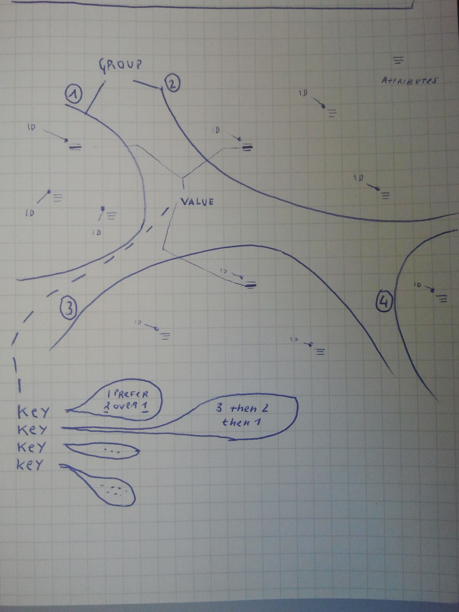

groupcover
==========

Staged deduplication.

Input:

```
id, group, attribute, [key, key, ...]
```

Items from different groups may share an attribute. Depending on a order
relation over groups (possibly per key), a number of keys may be dropped for
an entry.

Simple case
-----------

We have a single valued attribute, e.g. a DOI or an ISBN. We sort the input
the attribute and then process the list.

Sort by attribute:

```shell
$ sort -k3 < input.list > sorted.list
```

Process list:

```shell
$ groupcover < sorted.list > cleaned.list
```

Examples
--------

```shell
cat fixtures/sample.csv
id-1,group-1,value-1,Leipzig,Berlin
id-2,group-2,value-1,Berlin,Dresden
```

The Berlin key is repeated. By default, the group with the higher lexicographic value is choosen, so here Berlin
stays at id-2, but gets dropped from id-1:

```shell
$ groupcover < fixtures/sample.csv 2> /dev/null
id-1,group-1,value-1,Leipzig
```

```shell
$ cat fixtures/mini.csv
1,G1,A1,K1,K2
2,G1,A2,K1,K2
3,G2,A2,K1,K2,K3
4,G3,A2,K2
5,G1,A3,K1,K2,K3
6,G2,A3,K2,K3
7,G1,,K2,K3
8,G2,,K2,K3
9,G2,A4,K2,K3
A,G2,A4,K2,K3
```

Only the changed entries are written:

```shell
$ groupcover < fixtures/mini.csv 2> /dev/null
2,G1,A2
3,G2,A2,K1,K3
5,G1,A3,K1
```

Finc Index
----------

There is no DOI field in SOLR schema. The licensing information is available
only in *AILicensing*, in intermediate schema.

```shell
$ jq -r '[
    .["finc.record_id"],
    .["finc.source_id"],
    .["doi"],
    .["x.labels"][]?] | @csv' < <(unpigz -c /tmp/AILicensing/date-2016-11-28.ldj.gz) > input.csv
```


